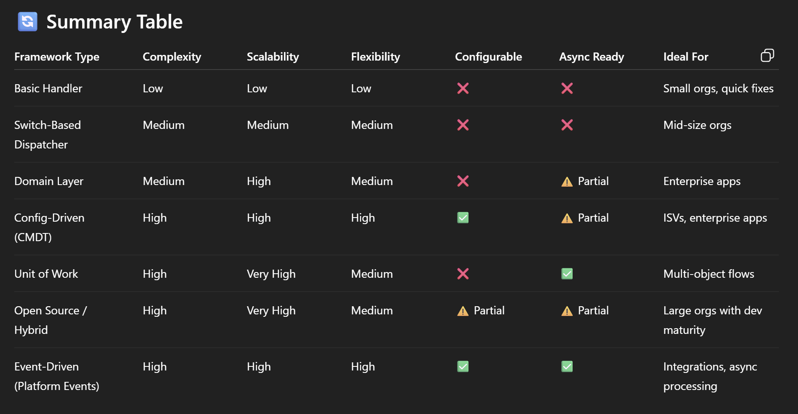

# ⚡ Salesforce Apex Trigger Framework (Hybrid | CMDT | UOW | Platform Events)

A modern, extensible, and production-ready Apex Trigger Framework for Salesforce projects. This framework blends best practices from open-source patterns (like fflib), configuration-driven flexibility, and enterprise-grade features like recursion guards, Unit of Work (UOW), and optional Platform Event-based decoupling.

---

## 📦 Features

- ✅ **CMDT-Driven Trigger Handler Registration** – no-code handler wiring
- 🔁 **Recursion Guard** – prevent re-entry and infinite loops
- 🧱 **Unit of Work (UOW)** – bulk-safe DML coordination
- 🧠 **Trigger Context Abstraction** – simplified logic with full context
- 🔄 **Event Filtering & Execution Order** – handler sequencing per event
- 🔔 **Platform Event Support (Optional)** – fully decoupled, async processing

---

## 🚀 Getting Started

1. **Deploy Metadata**  
   Use SFDX or your preferred deployment tool to push all metadata.

2. **Create CMDT Records**  
   Go to `Trigger_Handler_Config__mdt` and define mappings:
   - Object Name: `Account`
   - Event Type: `BEFORE_INSERT`
   - Handler Class: `AccountBeforeInsertHandler`
   - Execution Order: `1`
   - Active: ✅

3. **Implement Handlers**  
   Each handler class implements `ITriggerHandler` and defines logic per context.

4. **Use Platform Events (Optional)**  
   Publish Platform Events in triggers instead of direct logic. Handle events in separate listeners.

---

## 🧪 Testing & Best Practices

- Write unit tests per handler and per service class
- Use `Test.startTest()` and `Test.stopTest()` for platform event listener coverage
- Validate recursion guard logic in trigger test cases
- Assert UOW commits in expected order

---

## 💡 Advantages

- Centralized Logic Management
- Recursion Handling
- Bulk-Safe DML with Unit of Work
- Event Filtering and Granular Control
- Execution Order Control
- Configuration-Driven Logic (Metadata UI Switch)
- Supports Platform Event Decoupling
- Testability and Reusability

---

## 📚 Summary Table

| Concern                         | Trigger Framework Solution        |
| ------------------------------- | --------------------------------- |
| Spaghetti logic in trigger body | Handler-based separation          |
| Recursive trigger re-entry      | Recursion guard                   |
| DML inside loops                | Unit of Work pattern              |
| No control over logic order     | Execution order configuration     |
| Trigger logic hard to test      | Modular, testable handler classes |
| Deployment for every change     | CMDT-based handler registration   |
| Asynchronous decoupling needed  | Platform Event integration        |

---

## 🧭 Framework Comparison Table

